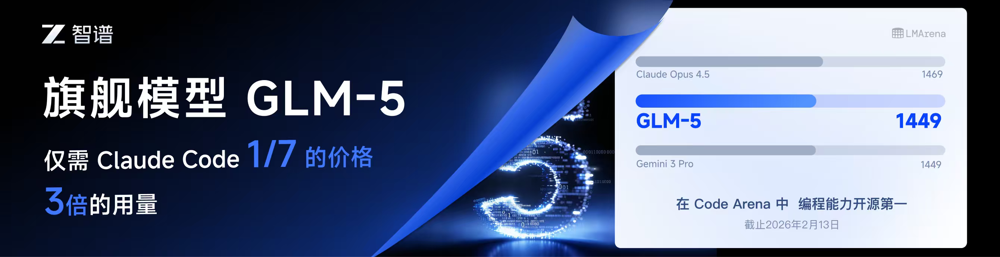

[![npm version][npm-version-src]][npm-version-href]
[![npm downloads][npm-downloads-src]][npm-downloads-href]
[![License][license-src]][license-href]
[![Claude Code][claude-code-src]][claude-code-href]
[![codecov][codecov-src]][codecov-href]
[![JSDocs][jsdocs-src]][jsdocs-href]
[![Ask DeepWiki][deepwiki-src]][deepwiki-href]

<div align="center">
  

  <h1>
    ZCF - Zero-Config Code Flow
  </h1>

  <p align="center">
    <a href="README.md">English</a> | <b>中文</b> | <a href="README_ja-JP.md">日本語</a> | <a href="CHANGELOG.md">更新日志</a>

**✨ 完整文档**: [文档入口](https://zcf.ufomiao.com/zh-CN/)

> 零配置,一键搞定 Claude Code & Codex 环境设置 - 支持中英文双语配置、智能代理系统和个性化 AI 助手
  </p>
</div>

## ♥️ 赞助商

[](https://www.bigmodel.cn/claude-code?ic=RRVJPB5SII)
本项目由 Z智谱 提供赞助, 他们通过 GLM CODING PLAN 对本项目提供技术支持。

GLM CODING PLAN 是专为AI编码打造的订阅套餐，每月最低仅需20元，即可在十余款主流AI编码工具如 Claude Code、Cline、Roo Code 中畅享智谱旗舰模型GLM-4.7（受限于算力，GLM-5 目前仅限Pro用户开放），为开发者提供顶尖的编码体验。

智谱AI为本产品提供了特别优惠，使用以下链接购买可以享受九折优惠：https://www.bigmodel.cn/claude-code?ic=RRVJPB5SII

---

[](https://share.302.ai/gAT9VG)
[302.AI](https://share.302.ai/gAT9VG) 是一个按用量付费的企业级AI资源平台，提供市场上最新、最全面的AI模型和API，以及多种开箱即用的在线AI应用。

---

<table>
<tbody>
<tr>
<td width="180"><a href="https://www.packyapi.com/register?aff=zcf"></a></td>
<td>感谢 PackyCode 赞助了本项目！PackyCode 是一家稳定、高效的API中转服务商，提供 Claude Code、Codex、Gemini 等多种中转服务。PackyCode 为本软件的用户提供了特别优惠，使用<a href="https://www.packyapi.com/register?aff=zcf">此链接</a>注册并在充值时填写"zcf"优惠码，可以享受9折优惠。</td>
</tr>
<tr>
<td width="180"><a href="https://www.aicodemirror.com/register?invitecode=ZCFZCF"></a></td>
<td>感谢 AICodeMirror 赞助了本项目！AICodeMirror 提供 Claude Code/Codex/Gemini CLI 官方高稳定中转服务，支持企业级高并发、极速开票、7x24专属技术支持。Claude Code/Codex/Gemini 官方渠道低至 3.8/0.2/10.9 折，充值更有折上折！AICodeMirror 为 ZCF 的用户提供了特别福利，通过<a href="https://www.aicodemirror.com/register?invitecode=ZCFZCF">此链接</a>注册的用户，可享受首充8折，企业客户最高可享 7.5折！</td>
</tr>
<tr>
<td width="180"><a href="https://crazyrouter.com/?utm_source=github&utm_medium=sponsor&utm_campaign=zcf&aff=yJFo"></a></td>
<td>感谢 Crazyrouter 赞助了本项目！Crazyrouter 是一个高性能 AI API 聚合网关 — 一个 Key 调用 300+ 模型（GPT、Claude、Gemini、DeepSeek 等），所有模型低至官方价格 5.5 折，支持自动故障转移、智能路由和无限并发。完全兼容 OpenAI 格式，可无缝接入 Claude Code、Codex 和 Gemini CLI。Crazyrouter 为 ZCF 用户提供了专属福利，通过<a href="https://crazyrouter.com/?utm_source=github&utm_medium=sponsor&utm_campaign=zcf&aff=yJFo">此链接</a>注册即送 $2 免费额度！</td>
</tr>
<tbody>
</table>

## 🚀 快速开始

- 推荐：`npx zcf` 打开交互式菜单，按需选择。
- 常用命令：

```bash
npx zcf i        # 完整初始化：安装 + 工作流 + API/CCR + MCP
npx zcf u        # 仅更新工作流
npx zcf --lang zh-CN  # 切换界面语言示例
```

- 无交互示例（预设提供商）：

```bash
npx zcf i -s -p 302ai -k "sk-xxx"
```

更多用法、参数与工作流说明请查看文档。

## 📖 完整文档

- https://zcf.ufomiao.com/zh-CN/

## 💬 社区

加入我们的 Telegram 群组，获取支持、参与讨论和接收更新：

[](https://t.me/ufomiao_zcf)

## 🙏 鸣谢

本项目的灵感来源和引入的开源项目：

- [LINUX DO - 新的理想型社区](https://linux.do)
- [CCR](https://github.com/musistudio/claude-code-router)
- [CCometixLine](https://github.com/Haleclipse/CCometixLine)
- [ccusage](https://github.com/ryoppippi/ccusage)
- [BMad Method](https://github.com/bmad-code-org/BMAD-METHOD)

  感谢这些社区贡献者的分享！


## ❤️ 支持与赞助

如果您觉得这个项目有帮助，请考虑赞助它的开发。非常感谢您的支持！

[](https://ko-fi.com/UfoMiao)

<table>
  <tr>
    <td></td>
    <td></td>
  </tr>
</table>

### 我们的赞助商

非常感谢所有赞助商的慷慨支持！

【企业赞助商】

- [302.AI](https://share.302.ai/gAT9VG) （第一个企业赞助商 🤠）
- [GLM](https://www.bigmodel.cn/claude-code?ic=RRVJPB5SII) （第一个 AI 模型赞助商 🤖）
- [PackyCode](https://www.packyapi.com/register?aff=zcf) （第一个 API 中转服务商赞助商 🧝🏻‍♀️）
- [AICodeMirror](https://www.aicodemirror.com/register?invitecode=ZCFZCF) （官方高稳定中转服务赞助商 🪞）
- [UUCode](https://www.uucode.org/auth?ref=JQ2DJ1T8)（赞助了 100$ 中转站额度 💰）
- [Crazyrouter](https://crazyrouter.com/?utm_source=github&utm_medium=sponsor&utm_campaign=zcf&aff=yJFo)（AI API 聚合网关赞助商 🚀）

【个人赞助商】

- Tc (第一个赞助者)
- Argolinhas (第一个 ko-fi 赞助者 ٩(•̤̀ᵕ•̤́๑))
- r\*r (第一个不愿透露姓名的赞助者 🤣)
- \*\*康 (第一个 KFC 赞助者 🍗)
- \*东 (第一个咖啡赞助者 ☕️)
- 炼\*3 (第一个 termux 用户赞助者 📱)
- [chamo101](https://github.com/chamo101) (第一个 GitHub issue 赞助者 🎉)
- 初屿贤 (第一个 codex 用户赞助者 🙅🏻‍♂️)
- Protein （第一个一路发发赞助者 😏）
- [musistudio](https://github.com/musistudio) (第一个开源项目作者赞助者，[CCR](https://github.com/musistudio/claude-code-router) 的作者哦 🤩)
- [BeatSeat](https://github.com/BeatSeat) (社区大佬 😎，提供了 $1000 Claude 额度)
- [wenwen](https://github.com/wenwen12345) (社区大佬 🤓，提供了每日 $100 Claude&GPT 额度)
- 16°C 咖啡 (我的好基友 🤪, 提供了 ChatGPT Pro $200 套餐)

### 推广感谢

感谢以下推广本项目的作者：

- 逛逛 GitHub，推文：https://mp.weixin.qq.com/s/phqwSRb16MKCHHVozTFeiQ
- Geek，推文：https://x.com/geekbb/status/1955174718618866076

## 📄 许可证

[MIT License](LICENSE)

---

## 🚀 贡献者

<a href="https://github.com/UfoMiao/zcf/graphs/contributors">
  
</a>
<br /><br />

## ⭐️ Star 历史

如果这个项目对你有帮助，请给我一个 ⭐️ Star！
[](https://star-history.com/#UfoMiao/zcf&Date)

<!-- Badges -->

[npm-version-src]: https://img.shields.io/npm/v/zcf?style=flat&colorA=080f12&colorB=1fa669
[npm-version-href]: https://npmjs.com/package/zcf
[npm-downloads-src]: https://img.shields.io/npm/dm/zcf?style=flat&colorA=080f12&colorB=1fa669
[npm-downloads-href]: https://npmjs.com/package/zcf
[license-src]: https://img.shields.io/github/license/ufomiao/zcf.svg?style=flat&colorA=080f12&colorB=1fa669
[license-href]: https://github.com/ufomiao/zcf/blob/main/LICENSE
[claude-code-src]: https://img.shields.io/badge/Claude-Code-1fa669?style=flat&colorA=080f12&colorB=1fa669
[claude-code-href]: https://claude.ai/code
[codecov-src]: https://codecov.io/gh/UfoMiao/zcf/graph/badge.svg?token=HZI6K4Y7D7&style=flat&colorA=080f12&colorB=1fa669
[codecov-href]: https://codecov.io/gh/UfoMiao/zcf
[jsdocs-src]: https://img.shields.io/badge/jsdocs-reference-1fa669?style=flat&colorA=080f12&colorB=1fa669
[jsdocs-href]: https://www.jsdocs.io/package/zcf
[deepwiki-src]: https://img.shields.io/badge/Ask-DeepWiki-1fa669?style=flat&colorA=080f12&colorB=1fa669
[deepwiki-href]: https://deepwiki.com/UfoMiao/zcf
